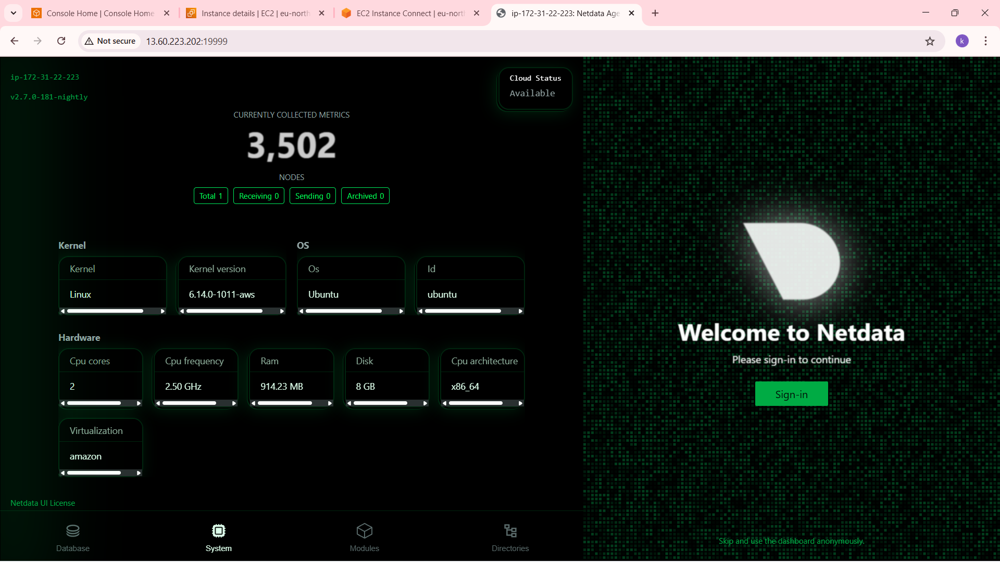

# 🖥️ Netdata System Monitoring Setup

## 📌 Objective

To install and configure **Netdata**, an open-source real-time performance monitoring tool, to visualize system metrics like CPU, memory, disk, and network usage.

---

## ⚙️ Steps Performed

### 1. System Update

```bash
sudo apt update -y && sudo apt upgrade -y
```

### 2. Netdata Installation

Installed Netdata using the official script:

```bash
bash <(curl -Ss https://get.netdata.cloud/kickstart.sh)
```

### 3. Service Verification

```bash
sudo systemctl status netdata
```

Ensured the Netdata agent was running and accessible on port **19999**.

---

## 🌐 Accessing the Dashboard

Open in your browser:

```
http://<server-ip>:19999
```

If using EC2, ensure port **19999** is open in the security group:

```bash
sudo ufw allow 19999/tcp
```

---

## 🐳 Docker Monitoring (if applicable)

Netdata automatically detects Docker containers and shows metrics under:

```
Containers → Docker
```

---

## 📸 Screenshot

Below is a sample view of the running **Netdata dashboard**:



---

## 📊 Key Insights

* **CPU Usage:** Average utilization around 20%, with spikes under load.
* **Memory Usage:** 45–60% active usage observed.
* **Disk I/O:** Minimal read/write during idle periods.
* **Network Traffic:** Constant low-level background traffic from monitoring tools.
* **Docker Stats:** Each container’s resource usage shown individually.

---

## 🧾 Logs & Config Paths

| Type     | Location            |
| -------- | ------------------- |
| Logs     | `/var/log/netdata/` |
| Configs  | `/etc/netdata/`     |
| DB Cache | `/var/lib/netdata/` |

---

## 📁 Repository Contents

netdata-monitoring-setup/
├── README.md
├── netdata-dashboard.png


---

## 👨‍💻 Author

**Ram Mohan Kavuri**
Cloud & DevOps Enthusiast | Linux | Docker | Kubernetes
